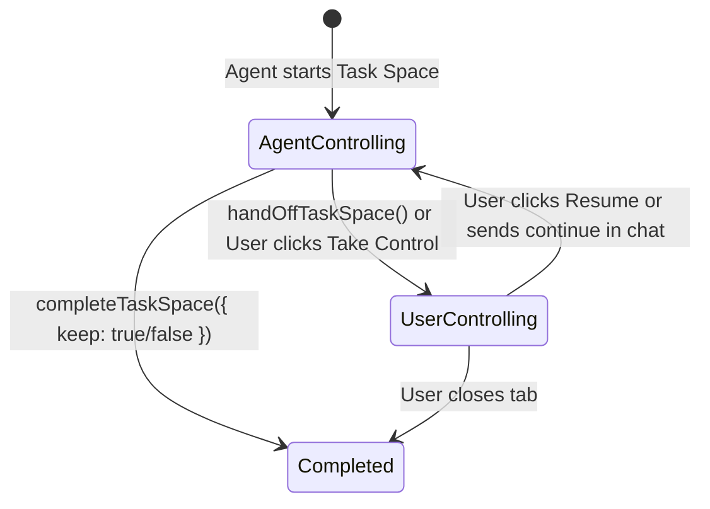

# TDE Embedded Web Browser: ego-lite Integration Architecture & Design RFC

> **Status**: Proposed / Design Specification  
> **Author**: Antigravity & TDE Core Team  
> **Target Platform**: macOS (Tauri v2 + Rust + React + ego-lite)  
> **Related Reference**: [ego-lite](https://github.com/citrolabs/ego-lite) | [ego-browser Skill](file:///.gemini/skills/ego-browser/SKILL.md)

---

## 1. Motivation & Background

### 1.1 The Disconnect in Agentic Coding
Modern developer workflows are split across two disconnected worlds:
1. **The Code & Terminal Surface**: CLI agents like Antigravity CLI (`agy`), Claude Code, Codex, and shell commands.
2. **The Web & Browser Surface**: Web documentation, web application testing, OAuth authentication flows, frontend previews, and live SaaS dashboards.

Existing browser automation solutions (Puppeteer, Playwright, browser-use) run in isolated headless or detached Chromium windows. They lose existing user logins, require re-authentication, and battle with the user for tab focus.

### 1.2 The ego-lite Advantage
**ego-lite** solves this fundamental friction by providing:
- **Task Spaces**: Sandboxed browsing contexts that inherit the user's logged-in cookies and credentials from ego-lite without hijacking or closing personal user tabs.
- **Lightweight Semantic Snapshots (`snapshotText`)**: Token-efficient AX/DOM accessibility trees with `@N` reference IDs that consume up to 80% fewer tokens than heavy screenshot-only vision models.
- **Fast Human-in-the-Loop Handoff (`handOffTaskSpace` / `takeOverTaskSpace`)**: Seamless transfer of control between AI agent and developer when dealing with CAPTCHAs, MFA, or sensitive credentials.

Integrating ego-lite as **TDE's embedded browser in the Right Inspector Panel** eliminates window switching and brings terminal-driven agent automation into a unified desktop environment.

---

## 2. System Architecture

```
+---------------------------------------------------------------------------------------------------+
|                                      TDE Desktop (Tauri v2)                                       |
|                                                                                                   |
|  +---------------------------------------+   +-----------------------+   +---------------------+  |
|  |         Center Left: Terminal         |   | Center Right: Preview |   |   Right Inspector   |  |
|  |                                       |   |                       |   |                     |  |
|  |  Level 2 Tabs: [Shell] [sess-1]       |   | [app.ts] [🌐 Localhost]|   | [Files][Git][Browser|  |
|  |                                       |   |                       |   |                     |  |
|  |  $ ego-browser nodejs <<'EOF'         |   | +-------------------+ |   | +-----------------+ |  |
|  |    const task = await ...             |   | | [Address Bar]     | |   | | Web Tabs (3)    | |  |
|  |    await openOrReuseTab(...)          |---|-> | [Full Resolution| |   | | + Open URL...   | |  |
|  |    await click('@12')                 |   | |  Live Web Page    | |   | | • Localhost:3000| |  |
|  |  EOF                                  |   | |  Viewport]        | |   | | • GitHub Repo   | |  |
|  |                                       |   | +-------------------+ |   | +-----------------+ |  |
|  +-------------------+-------------------+   +-----------------------+   +----------+----------+  |
|                      |                                                              ^             |
|                      v                                                              |             |
|           ego-browser CLI Process                                                   |             |
|                      +-----------------------+--------------------------------------+             |
|                                              v                                                    |
|                               ego-lite Engine (Chromium + CDP)                                    |
+---------------------------------------------------------------------------------------------------+
```

---

## 3. Integration Approaches for TDE Right Panel

We evaluate three complementary implementation approaches for embedding ego-lite into TDE's right panel:

### Approach A: Live CDP Screencast & Canvas Streaming (Recommended Phase 1)
- **Mechanism**: The `ego-browser` helper or TDE's Rust backend establishes a CDP session with the ego-lite task space target and calls `Page.startScreencast`.
- **Display**: High-frequency base64/JPEG frames stream directly into an HTML5 `<canvas>` component in TDE's right panel.
- **Interactivity**: User mouse clicks, wheel scrolls, and keyboard inputs on the canvas are translated into CSS viewport coordinates and dispatched via `Input.dispatchMouseEvent` / `Input.dispatchKeyEvent`.
- **Pros**:
  - Zero OS window clipping or coordinate synchronization bugs in Tauri.
  - Overlay capabilities: Can render real-time bounding boxes around active `@N` references from `snapshotText()`.
  - Works identically in pinned and floating right-panel states.

### Approach B: Tauri Child Webview Docking (Phase 2 Native View)
- **Mechanism**: Tauri v2 supports multi-webview layouts via `WebviewBuilder` or native macOS `WKWebView` / child NSView attached to the main NSWindow.
- **Display**: A native child webview is dynamically positioned over the right panel's viewport bounding rect.
- **Pros**: Full native hardware acceleration and 120 FPS scrolling.
- **Considerations**: Must handle resizing events when the user drags the right panel resizer.

### Approach C: Dual-Mode Inspector (Visual + Semantic AX Tree)
TDE's Right Panel provides a toggle between:
1. **Live View**: The visual rendering of the webpage (Screencast or Webview).
2. **Semantic Inspector**: The exact accessibility tree returned by `snapshotText()`, highlighting `@N` elements, tags, attributes, and text nodes so developers can watch what the AI agent "sees".

---

## 4. Human-in-the-Loop Handoff Experience

Control between the developer and Antigravity CLI follows a state machine:



1. **Agent Driving**:
   - The right panel header displays a green indicator: `[Agent Active]`.
   - Subtle pulse animations show where the agent is clicking (`label` highlights).
2. **User Takeover (Handoff)**:
   - When 2FA, CAPTCHA, or human judgment is required, the agent calls `await handOffTaskSpace(task.id)`.
   - The right panel border shifts to amber with an alert banner: `[User Controlling - Please complete verification]`.
   - The user interacts directly on the page in TDE.
3. **Resuming Agent**:
   - Once the user finishes, clicking **"Return to Agent"** triggers an event back to the active session.
   - The agent executes `await takeOverTaskSpace(task.id)` and resumes its automation flow.

---

## 5. UI Layout Specifications in TDE

In `src/App.tsx` and `src/store/workspaceStore.ts`:

1. **Right Panel Tab Bar**:
   - Add a `Browser` tab with a `Globe` or `Compass` icon next to `Files`, `Git`, `Search`, and `Skills`.
   - Automatically activate the `Browser` tab whenever an `ego-browser` task space is initiated from a terminal pane.
2. **Browser Top Bar**:
   - Back / Forward / Refresh navigation buttons.
   - Read-only or editable URL bar showing current page title and HTTPS lock status.
   - Active Task Space badge (`#ID: name`).
   - "Pop out to external ego-lite" button for when full multi-window interaction is preferred.
3. **Browser Bottom Toolbar**:
   - `Handoff / Take Over` control toggle button.
   - `Inspect AX Tree` toggle.
   - `Take Screenshot` quick export button.

---

## 6. Implementation Roadmap

| Milestone | Deliverables |
|---|---|
| **M1: Skill & CLI Foundation** | Create Antigravity CLI `ego-browser` skill in `.gemini/skills/ego-browser`, install script, and references. *(Completed)* |
| **M2: Right Panel Store & Shell UI** | Extend `workspaceStore` with `browser` right panel tab, add header controls, URL bar, and placeholder viewport. |
| **M3: CDP Screencast & State Sync** | Implement Rust/Tauri CDP bridge to capture ego-lite task space screencast frames and render them on TDE's canvas. |
| **M4: Two-Way Interaction & Handoff** | Wire up mouse/keyboard event dispatching and seamless handoff state badges between CLI agents and TDE frontend. |
