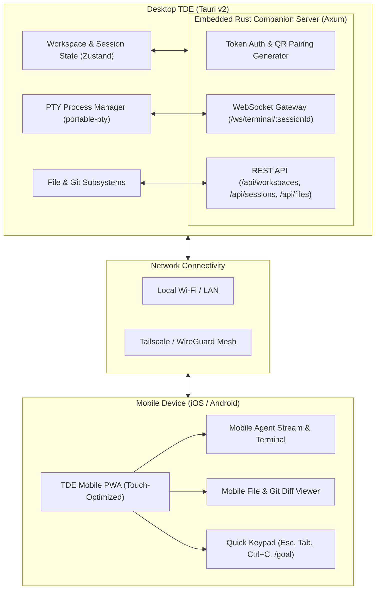

# Design: TDE Remote Mobile Companion

**Date:** 2026-09-02  
**Scope:** Desktop Tauri Backend (Rust Server) + Mobile Companion PWA (React)  
**Status:** Approved for Implementation  

---

## 1. Vision & Core User Scenarios

When developers and engineers are away from their workstation, they need a fast, low-friction way to monitor and interact with active workspaces and AI agents running on their primary machine.

### Core User Scenarios:
1. **Real-Time Agent Monitoring**: Check the progress of long-running agent tasks (Claude Code, Aider, Goose, Gemini CLI, Custom Agents) from a phone.
2. **Interactive Prompts & Tool Call Approval**: Answer agent clarification questions, approve bash tool executions, or send new prompts via mobile touch and dictation.
3. **Shell & Terminal Access**: View terminal scrollback, execute quick troubleshooting commands, and switch between active sessions with touch-optimized controls.
4. **Project & File Browsing**: Inspect project trees, read code/markdown files, and review Git diffs on mobile without needing a full laptop.
5. **Zero-Friction Instant Pairing**: Desktop displays a QR code containing the LAN/Tailscale address and a secure one-time session token. Scanning with the phone camera instantly launches the companion.

---

## 2. Architecture Overview

---

## 3. Subsystem Specifications

### Subsystem A: Embedded Rust Companion Server (`src-tauri/src/server/`)
1. **HTTP/WebSocket Framework**: Embedded `axum` with `tokio` and `tower-http` (CORS + compression + WebSockets).
2. **Dynamic Port & IP Discovery**:
   - Default port `3840` (auto-increments if occupied).
   - Enumerates available network interfaces (`en0`, `tailscale0`, Wi-Fi IP).
   - Generates a cryptographically random session pairing token (`token_hex`).
3. **REST Endpoints**:
   - `GET /api/status`: Handshake, server version, paired status.
   - `GET /api/workspaces`: List open workspaces and active father tabs.
   - `GET /api/sessions`: List active terminal/agent sessions grouped by project.
   - `GET /api/files/tree`: Workspace directory structure.
   - `GET /api/files/read`: Fetch file content / metadata (with large-file chunking).
   - `GET /api/git/status`: Git changed files and branch info.
   - `GET /api/git/diff`: File diff content.
4. **WebSocket Stream (`/ws/terminal/:sessionId`)**:
   - Bi-directional raw PTY / text stream between mobile client and desktop terminal instance.
   - Supports viewport resize packets (`{ type: "resize", cols: N, rows: N }`).
   - Supports heartbeat and reconnection replay.

---

### Subsystem B: Mobile Web Companion Client (`src/mobile/`)
1. **Responsive Mobile Shell**:
   - Sticky top bar with active project switcher, connection status badge, and desktop battery/CPU indicator.
   - Bottom navigation bar:
     - 💬 **Agents / Terminal**
     - 📁 **Files**
     - 🔀 **Git Changes**
     - ⚙️ **Settings**
2. **Touch-Optimized Terminal & Agent Chat**:
   - **Agent View**: Clean chat timeline rendering markdown, thinking blocks, and tool executions.
   - **Terminal View**: Lightweight `xterm.js` canvas or virtual terminal buffer optimized for mobile DPI.
   - **Virtual Action Strip** (Docked above mobile keyboard):
     - `Ctrl+C`, `Tab`, `Esc`, `Enter`, `↑`, `↓`, `Clear`, `Y/N`, `/goal`.
   - **Mobile Dictation**: Native Web Speech API integration for direct voice prompting.
3. **Mobile File & Git Diff Inspector**:
   - File explorer with folder accordion and breadcrumb navigation.
   - Syntax-highlighted code viewer and rich Markdown renderer with Mermaid diagrams.
   - Unified side-by-side or stacked diff view with colored additions/deletions.

---

### Subsystem C: Desktop Pairing & Management UI (`src/components/MobilePairingModal.tsx`)
1. **Desktop Trigger**: "Mobile Remote" button on the desktop header bar.
2. **Pairing Modal**:
   - QR Code encoding: `http://<chosen-ip>:3840/?token=<secret-token>`.
   - Interface selector dropdown: Automatically defaults to Tailscale IP (if active) or LAN Wi-Fi IP.
   - Connected devices list with ability to revoke sessions.
   - Server toggle switch (Enable/Disable companion server on demand).

---

## 4. Security & Isolation Model
1. **Token Authentication**: Every REST request and WebSocket connection requires a valid `Bearer <token>` matching the active desktop pairing session.
2. **Local / Mesh Bound**: Server binds to local LAN or Tailscale interfaces only (no public cloud exposition required).
3. **Read-Only / Protected Operations**: Destructive actions (such as project directory deletion or arbitrary binary execution) require explicit desktop-side confirmation toggle.

---

## 5. Phased Implementation Plan

### Phase 1: Rust Embedded Server & Protocol Gateway
- [ ] Add `axum`, `tower-http`, `tokio-tungstenite` to `src-tauri/Cargo.toml`.
- [ ] Implement `src-tauri/src/server/mod.rs` with token generation, routing, and lifecycle hooks.
- [ ] Implement REST endpoints (`/api/workspaces`, `/api/sessions`, `/api/files`, `/api/git`).
- [ ] Implement WebSocket PTY terminal gateway connecting directly to `portable-pty`.
- [ ] Add unit tests for auth middleware, route handlers, and token validation.

### Phase 2: Desktop Pairing Modal & QR Engine
- [ ] Install `qrcode.react` for desktop QR generation.
- [ ] Build `MobilePairingModal.tsx` with interface selector, QR renderer, and connection status.
- [ ] Add "Mobile Remote" icon button in desktop header bar.
- [ ] Add Tauri commands `start_companion_server`, `stop_companion_server`, `get_companion_network_interfaces`.

### Phase 3: Mobile PWA Frontend & Shell
- [ ] Create mobile routing and responsive shell layout (`src/mobile/MobileApp.tsx`).
- [ ] Build `MobileSessionView.tsx` with agent timeline, virtual terminal, and quick action toolbar.
- [ ] Build `MobileFileView.tsx` and `MobileGitView.tsx` with touch-friendly layout.
- [ ] Configure `manifest.json` and PWA icon assets for Home Screen installation on iOS/Android.

### Phase 4: Real-Time Polish & Resilience
- [ ] Implement automatic WebSocket reconnection with exponential backoff on network drop.
- [ ] Add mobile notifications using the Web Notification API when agent tasks complete.
- [ ] Automated end-to-end testing with mock mobile viewport.
