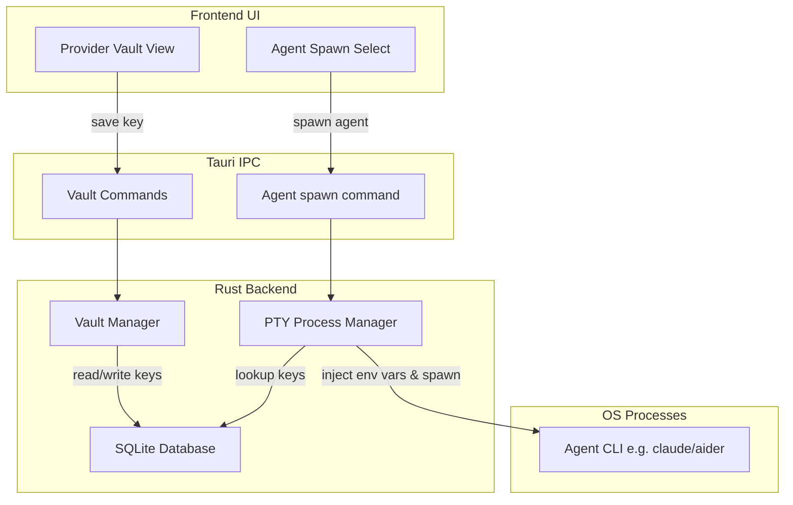

# TDE Sub-Project 4: Provider & Adapter Layer Design

## 1. Overview
This design specification details the architecture of the **Provider Management Layer** and the **Agent Runtime Adapter System**. It enables users to configure API keys for multiple providers (Anthropic, OpenAI, Gemini, etc.), store them securely in the local SQLite database, and spawn specific agent CLI binaries (like `claude`, `aider`, `gemini-cli`) inside PTY shells pre-injected with the correct model settings and environment variables.

---

## 2. Technical Architecture

The Provider & Adapter system acts as an environment injection layer during process spawning.



---

## 3. Database Schema Extensions

We will store API keys securely in a new table `provider_keys` in SQLite:

```sql
CREATE TABLE IF NOT EXISTS provider_keys (
    provider TEXT PRIMARY KEY,    -- 'anthropic', 'openai', 'gemini', etc.
    api_key TEXT NOT NULL,         -- API Key string
    updated_at DATETIME DEFAULT CURRENT_TIMESTAMP
);
```

To support this table, we will add a new migration script `20260702000000_provider_keys.sql` in the migrations folder.

---

## 4. Backend Command Specifications

We will implement the following new Tauri commands in `src-tauri/src/main.rs` (or modularized into `src-tauri/src/provider.rs`):

1. `save_provider_key(provider: String, api_key: String) -> Result<(), String>`
   Inserts or updates the API key for a provider in the database.
2. `get_provider_keys() -> Result<Vec<ProviderKeyEntry>, String>`
   Retrieves all configured providers (with keys partially masked for safety).
   ```rust
   #[derive(serde::Serialize)]
   pub struct ProviderKeyEntry {
       pub provider: String,
       pub has_key: bool,
   }
   ```
3. `spawn_agent_session(...)`
   Extends `spawn_session` to:
   * Query the required API key for the selected provider from `provider_keys`.
   * Set it as an environment variable (e.g. `ANTHROPIC_API_KEY` for Anthropic, `OPENAI_API_KEY` for OpenAI, etc.) in the `CommandBuilder` environment map before launching the PTY.
   * Map `agent_type` to specific CLI launch command defaults:
     * `'claude'` -> runs command `claude` (Claude Code CLI)
     * `'aider'` -> runs command `aider` (Aider CLI)
     * `'gemini'` -> runs command `gemini-cli`
     * `'bash'` -> runs `/bin/zsh` or `/bin/bash`

---

## 5. Frontend UI Specifications

### Provider Vault Manager Pane (`src/components/ProviderVault.tsx`)
A panel where the user can:
* Select a provider (Anthropic, OpenAI, Gemini, DeepSeek, OpenRouter).
* Type the API key and save it.
* See which providers are configured (green status indicator) or unconfigured (gray).

### Extended Session Panel
The "Spawn Process" form in the sidebar will be upgraded to an "AI Agent Launcher":
* Select Agent Type: `Claude Code`, `Aider`, `Gemini CLI`, or `Standard Shell`.
* Select Model/Provider (pre-populated options).
* When clicking "Spawn", it calls `spawn_session` with injected env vars automatically handled by the Rust backend.

---

## 6. Testing Strategy
1. **Database Vault Tests**:
   * Verify insert and update operations on the `provider_keys` table.
2. **Environment Variable Injection Tests**:
   * Verify PTY process successfully reads the injected API key env vars.
