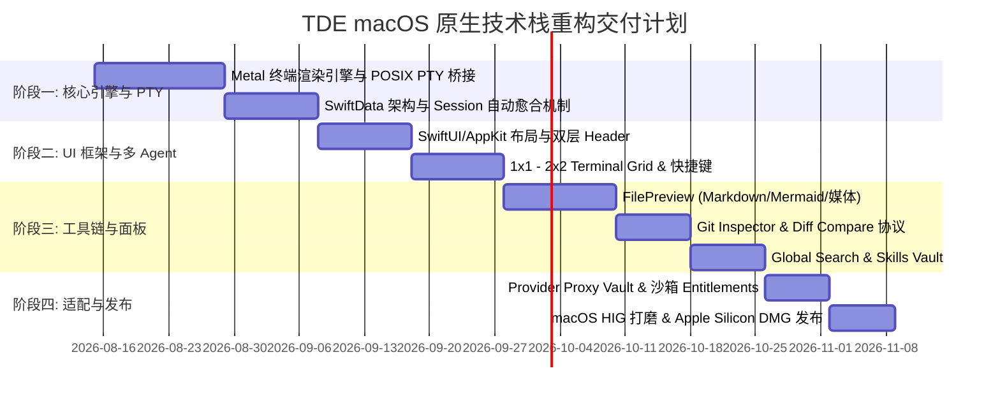

# TDE (Terminal Development Environment) macOS 原生架构需求与设计文档 (PRD)

> **文档版本**: 1.0.0  
> **面向平台**: macOS (Apple Silicon M1/M2/M3/M4 & Intel 64-bit)  
> **核心定位**: 基于 Apple 原生技术栈的下一代高性能多 Agent 终端集成开发环境

---

## 1. 项目概述与愿景 (Project Overview & Vision)

### 1.1 产品定位
TDE (Terminal Development Environment) 是一款专门面向 macOS 开发者打造的原生终端驱动型集成开发环境。其核心使命是将**多 CLI AI Code Agent（如 Claude Code, Antigravity CLI `agy`, OpenCode, Pi, Oh My Pi `omp`, Gemini CLI, Codex, Aider 等）**与**原生 Shell 终端（zsh, bash, fish, tmux, SSH）**无缝融合，并配备现代 IDE 必备的文件视图、代码预览、Git 差异比对、全局搜索、Agent Skills 技能库以及模型代理中转能力。

### 1.2 核心痛点与解决方案
* **传统终端痛点**: 缺乏 Agent 上下文持久化、多 Agent 并发分屏繁琐、代码预览与 Markdown 图表渲染能力弱、环境变量与代理配置复杂。
* **TDE 解决方案**: 
  - 提供多单元格动态网格（1x1, 1x2, 2x1, 2x2）与全状态保持。
  - 会话自动愈合与持久化恢复（SQLite / SwiftData），彻底避免 Session 丢失或启动空白 ID。
  - 原生支持 `Shift+Enter` 多行换行与 `Enter` 提交分离。
  - 内置基于 Metal / Swift 渲染的高性能 Terminal 与多格式（Markdown/KaTeX/Mermaid/媒体/PDF）文件预览器。

---

## 2. macOS 原生技术栈架构要求 (macOS Native Tech Stack)

为了提供极其流畅的 120Hz ProMotion 帧率、毫秒级响应速度以及与 macOS 系统深深契合的用户体验，本项目**全量采用 macOS 原生技术栈**重新架构：

```
+-------------------------------------------------------------------------+
|                        macOS 原生 UI 层 (SwiftUI 6)                      |
|  - HIG 视觉规范 (.ultraThinMaterial 莫兰迪暗色系毛玻璃)                     |
|  - 响应式双层 Header (Level 1 Project Tabs + Level 2 Session/File Tabs)  |
|  - 可拖拽 Splitter、全局 Command Palette (Cmd+K)                        |
+-------------------------------------------------------------------------+
|                       终端渲染引擎 (Metal / CoreText)                    |
|  - Metal 2D/3D 低延迟 GPU 终端渲染 (120 FPS ProMotion)                   |
|  - CoreText 高性能 Nerd Fonts/Powerline 字形与 Unicode 符号渲染            |
+-------------------------------------------------------------------------+
|                  系统 PTY 与进程调度层 (Swift Concurrency)               |
|  - POSIX openpty/forkpty 原生 C/Swift 桥接                              |
|  - 自动环境变量前置补全 (/opt/homebrew/bin, ~/.cargo/bin, NVM 等)          |
|  - 异步 TaskGroup / Actor 隔离的高并发 IO 管道                          |
+-------------------------------------------------------------------------+
|                    持久化与配置管理层 (SwiftData / SQLite)               |
|  - SwiftData / SQLite WAL 模式管理 Sessions & Workspace                 |
|  - App Sandbox 合规与 Entitlements 目录授权                              |
+-------------------------------------------------------------------------+
```

### 2.1 核心技术选型规格

| 架构模块 | 技术选型 | 选用Rationale / 性能要求 |
| :--- | :--- | :--- |
| **开发语言** | Swift 6.0 | 启用 Complete Concurrency Checking，保证绝对的线程安全与零运行时数据竞争。 |
| **界面框架** | SwiftUI + AppKit 混合架构 | 使用 SwiftUI 构建声明式组件；使用 AppKit (NSWindow, NSSplitView, NSTabView) 实现高级窗口控制与拖拽分栏。 |
| **终端渲染引擎** | Metal + SwiftTerminal (或 CoreText + libvterm) | 利用 GPU 直接渲染 Terminal 字符与 ANSI 颜色，降低 90% CPU 占用，支持 120Hz ProMotion。 |
| **系统 PTY 接口** | POSIX `openpty` / `forkpty` / `termios` | 原生 C/Swift 桥接，精细控制窗口尺寸 (`winsize` ioctl)、流式 Stdout 捕获与信号传递。 |
| **并发与异步模型** | Swift Concurrency (`async/await`, `Actor`, `@Observable`) | 取代传统闭包回调，实现 PTY 数据流、数据库读写与 UI 绑定的高效并发调度。 |
| **本地数据存储** | SwiftData / SQLite (WAL Mode) | 高性能事务持久化，存储 Workspace、Session 状态、PTY 屏幕历史与中转 Key 配置。 |
| **系统集成与权限** | macOS Entitlements & TCC 授权 | 配置 `Entitlements.plist`，支持用户选择文件、`Downloads`/`Documents` 目录读写合规。 |

---

## 3. 核心功能模块与详细需求 (Core Features Specification)

### 3.1 顶栏双层标签页与项目视图管理 (Level 1 & Level 2 Navigation)

* **Level 1 项目父标签页 (Project Tabs)**:
  - 顶部显示当前打开的项目（Workspace）标签。
  - 鼠标悬停项目标签时显示 `'x'` 快速关闭按钮，点击可将项目标签从顶栏移除（**仅隐藏顶栏标签，绝不从左侧项目列表中删除**）。
  - 关闭当前激活的项目标签时，自动平滑切换到相邻的打开项目。
  - 在左侧项目列表中点击任何项目，自动在顶栏打开/切回该项目标签。
  - 顶部导航栏最左侧集成原生齿轮图标，点击直接切换/开启 Settings 全屏仪表盘。
* **Level 2 视图与 Session 标签页 (Child Tabs)**:
  - 左侧展示当前项目激活的终端 Session 标签列表（支持切换、删除提示、新增 Session 按钮）。
  - 右侧展示当前打开的文件与 Git Diff 视图标签（支持鼠标拖拽重排序、点击关闭）。
  - 右侧集成 `Pin` 固定按钮：点击可在“Terminal (左) + File Preview (右) 并排固定分屏模式”与“全屏切换模式”之间自由切换。
  - 右侧集成 `Hide Preview` (隐藏预览) 按钮：点击可临时隐藏预览窗口，但不关闭已打开的文件标签。
  - 集成 Grid 布局下拉切换器（1x1, 1x2, 2x1, 2x2）。

---

### 3.2 高性能多单元格终端网格 (Terminal Grid & PTY Engine)

* **多分屏网格 (Terminal Grid)**:
  - 支持 `1x1` (单屏)、`1x2` (双栏横向)、`2x1` (双栏纵向)、`2x2` (四宫格) 四种动态分屏布局。
  - 每个分屏单元格带有 Header，显示当前分配的 Session 名称、Agent 类型及快捷 Attach/Detach 按钮。
* **全状态保持 (State Preservation)**:
  - 切换项目标签、打开/关闭 Settings 页面、隐藏/显示 Preview 视图时，**绝对禁止销毁 xterm/Metal 终端实例**。
  - 界面隐藏时使用 CSS/AppKit 隐藏控制，保持后端 PTY 进程与渲染缓冲区在内存中完好无损。
* **键盘响应与换行控制 (Keybinding & Enter Handling)**:
  - **`Shift+Enter` 彻底拦截与换行**: 拦截 `Shift+Enter` 的 `keydown` 与 `keyup` 事件，发送 `\n` (`0x0A` Line Feed)，确保 Code Agent（如 Claude Code, agy, opencode 等）在多行输入框中正确插入新行，**绝对禁止误触发 Prompt 提交**。
  - **`Enter` 提交**: 单击 `Enter` 发送 `\r` (`0x0D` Carriage Return)，触发 Agent Prompt 提交。
* **系统 PATH 路径智能增强 (PATH Resolution)**:
  - 在 PTY 进程启动前，自动将 Homebrew (`/opt/homebrew/bin`, `/opt/homebrew/sbin`)、`/usr/local/bin`、Cargo (`~/.cargo/bin`)、Gemini (`~/.gemini/bin`)、Local (`~/.local/bin`)、Bun (`~/.bun/bin`)、NVM Node 路径**前置注入至 `PATH` 最前端**。
  - 彻底解决 macOS 桌面应用从 Finder 启动时因默认 PATH 过于简陋导致 `.zshrc` 报 `command not found: starship/fzf/zoxide` 的问题。
* **字符编码与 Nerd Fonts 适配**:
  - 默认注入 `LANG=en_US.UTF-8` 与 `LC_ALL=en_US.UTF-8` 环境变量。
  - 内置 `MesloLGS NF`、`JetBrains Mono Nerd Font` 字体偏好与 Unicode Custom Glyphs，确保 Powerline 箭头与图标无乱码渲染。

---

### 3.3 Code Agent 多 Agent 生命周期与自动愈合恢复 (Agent Lifecycle & Auto-Healing)

* **原生支持 Agent 列表**:
  - `claude` (Claude Code)
  - `agy` (Antigravity CLI)
  - `opencode` / `open-code`
  - `pi` / `pi-agent`
  - `omp` / `oh-my-pi`
  - `gemini` (Gemini CLI)
  - `codex`
  - `aider`
  - 系统 Shell: `zsh`, `bash`, `fish`, `tmux`
  - 远程连接: `SSH`
* **Agent 命令智能提取 (`extract_agent_kind`)**:
  - 自动解析带绝对路径（如 `/usr/local/bin/claude`）、包装脚本（如 `npx agy`）及附加参数（如 `--dangerously-skip-permissions`）的命令，精准归类 Agent 类型。
* **会话自动愈合与恢复 (Auto-Healing Resume)**:
  - 实时存储会话记录至 SQLite/SwiftData（包括 Session ID, Workspace Path, CWD, Agent Type, Remote Conversation UUID）。
  - 当启动新会话时，自动分配 UUID 并使用 `--conversation <uuid>` / `--session-id <uuid>` / `--session <uuid>` 启动 Agent。
  - 当重新打开上一次关闭的 Agent 会话时：
    - 优先拉取 SQLite 中保存的 `remote_session_id`。
    - **自动愈合缺陷**: 若数据库中 `remote_session_id` 为空，自动生成全新 UUID 并实时补全更新至 SQLite，然后带参唤醒 Agent，**彻底杜绝“显示 [Session disconnected...] 但实际上唤醒了一个全新空会话”的 Bug**。
  - 实时解析 PTY Stdout 输出数据流，若探测到 Agent 输出的新 Conversation ID，自动同步更新数据库。

---

### 3.4 项目文件树与多格式文件预览器 (File Explorer & Multi-Format Previewer)

* **项目文件树 (FileTree)**:
  - 支持多层级文件夹展开/折叠。
  - 支持新建文件、新建文件夹、文件重命名、删除。
  - 支持隐藏文件（以 `.` 开头）与 `.git`/`node_modules` 的切换显示。
  - 鼠标悬停在文件上时，在浮层显示文件完整绝对路径。
* **多格式文件预览器 (FilePreview)**:
  - **代码高亮**: 支持 JavaScript, TypeScript, Python, Swift, Rust, Go, C++, HTML, CSS, JSON, YAML 等数十种语言的语法高亮与行号显示。
  - **Markdown 引擎**: 支持 GitHub 风格 Alert 警告框（Note, Tip, Important, Warning, Caution），集成 KaTeX 数学公式渲染。
  - **Mermaid 动态图表**: 自动解析以 `mermaid` 标记的代码块，动态渲染流程图、时序图、甘特图、类图及架构图。
  - **媒体预览**: 支持 PNG, JPG, WebP, SVG 图片预览；支持 MP4, WEBM 视频与 MP3, WAV 音频播放。
  - **文档预览**: 支持 PDF 文件的多页渲染与缩放预览。
* **侧边并排拖拽 Splitter**:
  - 在 Pin 钉住模式下，Terminal 区域与 FilePreview 区域水平并排，中间提供 `1.5px` 可拖拽 Splitter 控件，支持鼠标拖拽实时调整两侧宽度比例（20% ~ 80%）。

---

### 3.5 Git 版本控制与 Diff 差异对比 (Git Inspector & Diff Compare)

* **分支快速切换 (Branch Quick Switch)**:
  - Git 面板顶栏及右侧 Inspector 提供当前分支标题下拉菜单，实时列出仓库所有本地与远程分支，支持一键切换。
* **工作区变更文件列表 (Git Status)**:
  - 实时解析当前仓库的 Modified (已修改), Staged (已暂存), Untracked (未跟踪), Deleted (已删除) 文件。
  - 点击任何变动文件直接开启侧边 Diff 对比。
* **Commit 历史与信息展开**:
  - 列表展示仓库历史提交记录。
  - 针对长 Commit 信息，提供展开/折叠图标按钮，支持查看全量提交说明文本。
* **Git Diff 差异对比视图 (`GitDiffCompare`)**:
  - 采用 `git-diff:` 虚拟协议。
  - 侧边并排高亮对比变更前与变更后的代码，精确显示绿色加号新增行与红色减号删除行。

---

### 3.6 项目全局搜索 (Global Search Panel)

* **高性能 Grep 文件搜索**:
  - 输入关键词即可对当前 Workspace 下的所有代码与文本文件进行全文检索。
  - 自动过滤与忽略 `.git`, `node_modules`, `dist`, `build`, `target` 以及二进制媒体文件。
* **精准定位与点击跳转**:
  - 搜索结果按文件分组展示匹配行号与上下文文本。
  - 单击任何搜索结果，自动在 FilePreview 中打开目标文件并高亮滚动定位至所在行号。

---

### 3.7 Agent Skills 技能库管理 (Skills Vault)

* **技能发现与解析**:
  - 自动扫描与解析当前项目本地 `.agents/skills/` 目录以及 macOS 用户全局 `~/.gemini/config/skills/` 目录下的技能库。
* **SKILL.md 渲染与编辑**:
  - 提供树状 Skills 浏览视图，解析 YAML 前置元数据（Skill 名称、描述、触发条件）。
  - 支持实时预览与在线修改 `SKILL.md` 指令内容。

---

### 3.8 模型代理与密钥保险库 (Provider Vault & Settings)

* **代理中转服务管理 (Proxy Providers)**:
  - 支持配置 Anthropic, OpenAI, Google Gemini, Ollama, vLLM 及自定义第三方中转 Base URL 与 API Key。
  - 支持将内置 Agent（如 Claude, agy, opencode 等）的请求统一路由至选定的 Proxy Provider。
* **虚拟模型映射 (Proxy Virtual Models)**:
  - 支持建立虚拟模型别名映射（例如将 `claude-3-5-sonnet` 映射至指定 Provider 的底层模型）。
* **提权与静默授权 (Privileged Mode)**:
  - 提供全局开关，开启后自动为 Code Agent 追加 `--dangerously-skip-permissions` 标志，实现自动化极速执行。

---

## 4. macOS 原生性能指标与质量要求 (Non-Functional Requirements)

```
                       +-----------------------------------+
                       |    macOS Native 性能与质量指标    |
                       +-----------------------------------+
                       |  - 冷启动时间: < 200 ms           |
                       |  - 内存占用 (多Terminal): < 80 MB |
                       |  - 渲染帧率: 120 FPS ProMotion    |
                       |  - CPU 空闲占用: ~ 0.0 %           |
                       |  - 崩溃率: < 0.01 %               |
                       +-----------------------------------+
```

1. **极致启动速度**:
   - macOS 应用冷启动时间不得超过 `200ms`。
   - 数据加载使用 SwiftData 延迟加载（Lazy Loading），避免主线程阻塞。
2. **极低内存与 CPU 消耗**:
   - 应用静止空闲时 CPU 占用率降至 `0.0%`。
   - 在同时运行 4 个 Agent Terminal 会话与打开多个文件预览时，整体 Memory Footprint 控制在 `80MB` 以内。
3. **流畅度与触控控体验**:
   - Terminal 滚动与界面过渡必须达到全帧率 `120 FPS`（支持 Apple Silicon Mac 的 ProMotion 刷新率）。
   - 彻底解决任何界面闪烁、黑屏或二次重绘问题。
4. **沙箱合规与安全性**:
   - 必须通过 Apple macOS Hardened Runtime 编译校验。
   - 必须完整配置 `Entitlements.plist` 文件权限，确保正常读取 `~/Downloads`, `~/Documents` 及项目源码目录。

---

## 5. macOS 原生重构实施路线图 (Implementation Roadmap)



---

## 6. 总结 (Conclusion)

本需求文档 (`docs/tde_prd_mac.md`) 全量总结并规范了 TDE 项目的所有现有核心功能、业务逻辑与缺陷修复细节，并确立了**全面转向 Swift 6 + SwiftUI + Metal + SwiftData 的 macOS 原生技术栈**。通过这一架构升级，TDE 将在 Apple Silicon Mac 上展现出超越传统 Electron / Web 架构的巅峰性能与优雅体验。
